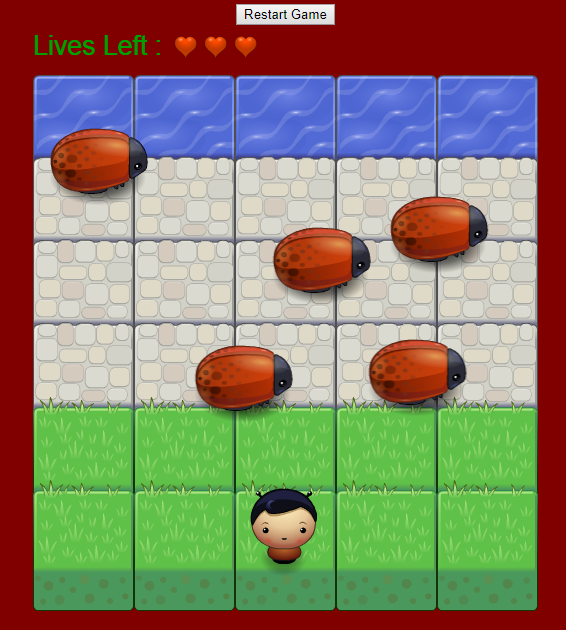

frontend-nanodegree-arcade-game
===============================

## Description

This is my 6th project in the Udacity Nanodegree program. The goal is to create an arcade frogger game using object oriented programming skills in JavaScript and HTML5
canvas. The images, engine.js and resources.js are provided. The main work is to be done on app.js file.

## Loading instructions

Load **index.html** with the help of your favorite browser.

## How to play

Use the arrow keys to move the player and cross the board. To win, you need to reach the water but you should avoid colliding with the bugs.

You have three lives. Each time you get taken down by a bug, you lose one life. If you lose three lives it will be game over for you.

You can restart the game by using the restart button on the top of the board.

## How it should look like

## Go for it!!
